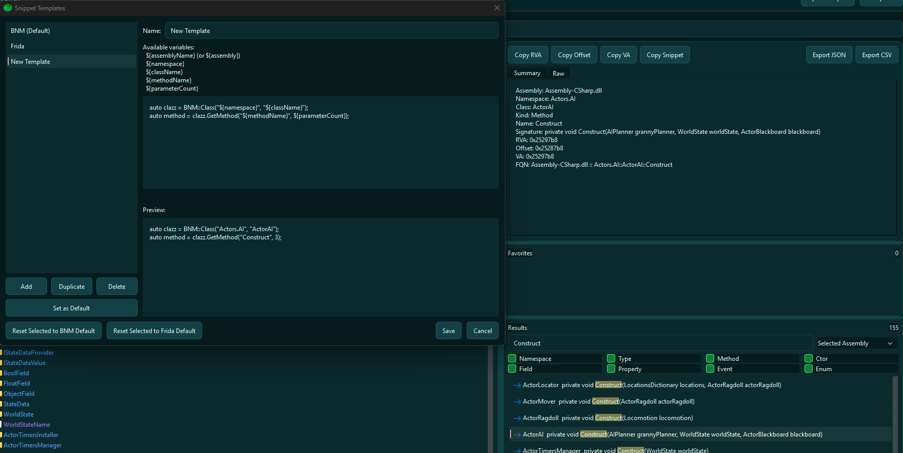
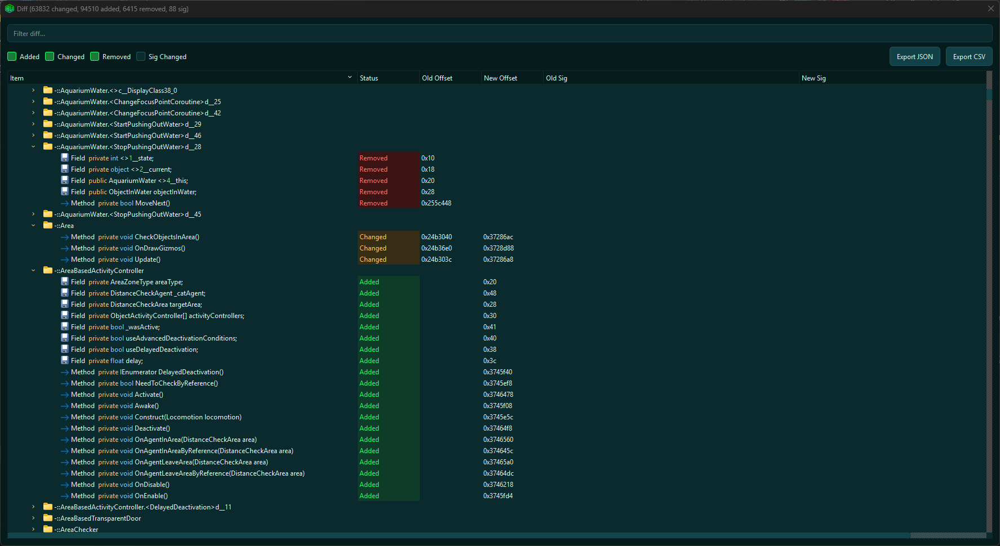
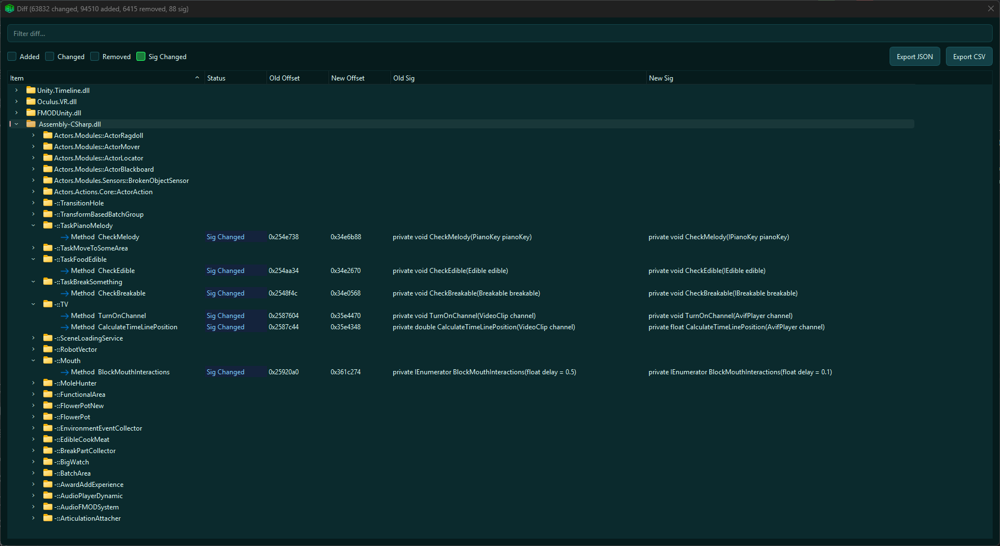

# DumpCsExplorer

A DnSpy-style explorer for IL2CPP Dumper `dump.cs` files. No DummyDLLs? No Problem.

- Browse dump.cs files more efficiently
- Customizable hook snippet generator
- Copy Offsets
- Compare two dumps between versions and export diffs
- Favorites
- More info below


## Screenshots

### Explorer (tree + details + search results + hook snippet generation)


### Snippet Generator Template Manager



### Compare / Diff




## Features

### Explorer tree
- Organized as **Assembly → Namespace → Type → Members**.
- Type nodes expand into grouped members (Constructors/Methods/Properties/Fields/Events/Enums).

### Details panel (Summary + Raw)
- Selecting any node updates the details panel.
- **Summary** shows structured fields (assembly/namespace/type/member metadata).
- **Raw** shows the original dump text from the selection.
- Copy helpers: **RVA**, **Offset**, **VA**, **Snippet**.
- Export selection to **JSON** / **CSV** (type or member).

### Search (fast + scoped)
- Bottom-right results panel with:
  - Query box with debounced, non-blocking filtering
  - Kind filters (Namespace/Type/Members)
  - Optional scope (All / Selected Assembly / Selected Namespace / Selected Type)
- Results **highlight matched substrings**.
- Click a result to navigate to the tree item.

### Snippets (Generate BNM/Frida-style hooks, or Customize it)
- Right-click members and **Generate Snippet**.
- Template system with placeholders (e.g. `${assemblyName}`, `${namespace}`, `${className}`, `${methodName}`, `${parameterCount}`).
- Manage multiple templates, pick a default, and preview output.

### Favorites
- Right-click a type/member and **Add to Favorites**.
- Favorites panel lets you jump back to frequently used targets.

### Compare / Diff (two dumps)
- Detects changes in **Signatures**, **Offset**, **RVA**, and **VA**.
- Grouped results tree: **Assembly → Type → Entries**.
- Filter by status + text search.
- Export visible diffs to **JSON** / **CSV**.

## Building

### Requirements
- CMake 3.20+
- A C++20 compiler
- Qt6 (Widgets + Concurrent)

### Configure + build (CMake)

```bash
cmake -S . -B build
cmake --build build --config Release
```

- Then run (change path):
```bash
PATH\TO\QT\mingw_64\bin\windeployqt.exe --release --no-translations --no-system-d3d-compiler DumpCsExplorer.exe
```

### Run
Open the built executable, then:
- Click **Open dump.cs**
- Optionally click **Compare...** after the first dump loads


## Project layout

- `src/parser/`
  - `DumpCsParser.*`: parsing logic for `dump.cs` into a lightweight in-memory model
- `src/ui/`
  - `MainWindow.*`: main UI, tree population, searching, diff dialog


## Notes

- This tool does **not** generate dumps. It assumes you already have `dump.cs`.
- Intended for large files: lazy-loading + lightweight indexing to keep interactions snappy.

## Settings / config

Settings (templates, UI state, recent files, favorites) are stored via `QSettings` in the per-user app config location:

`AppData/Local/DumpCsExplorer/DumpCsExplorer.ini`
