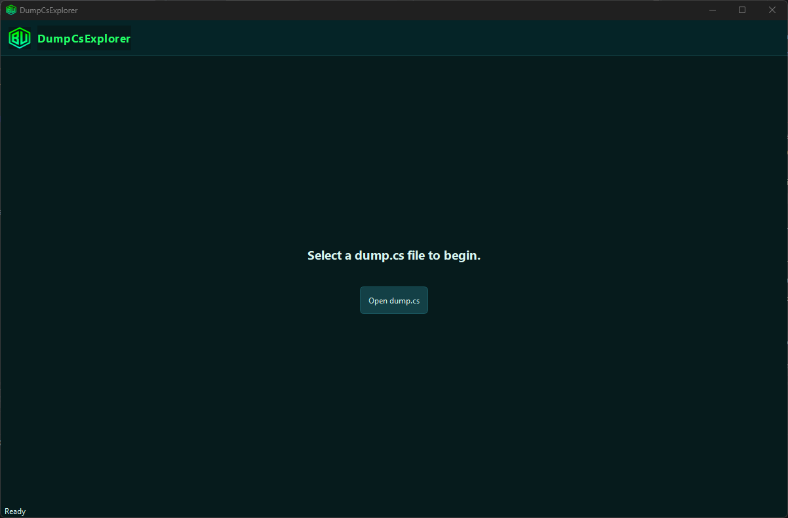
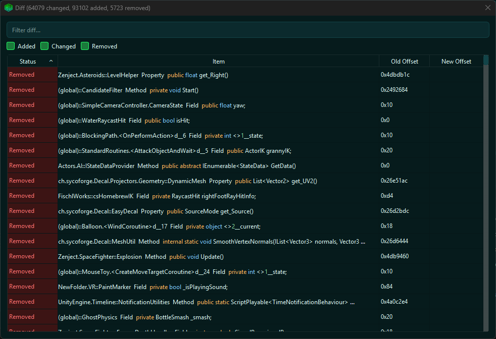
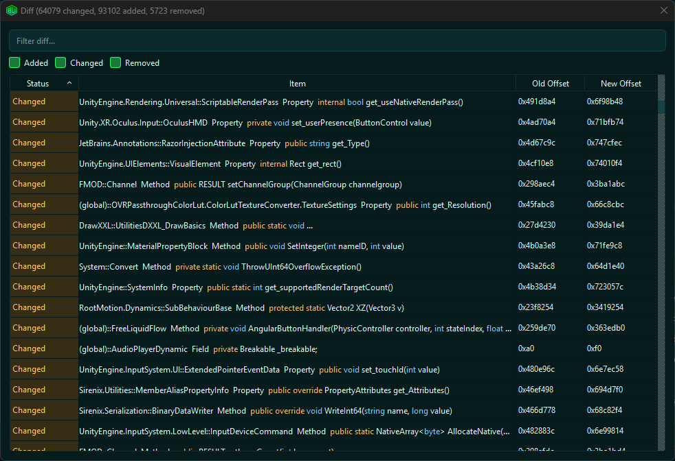
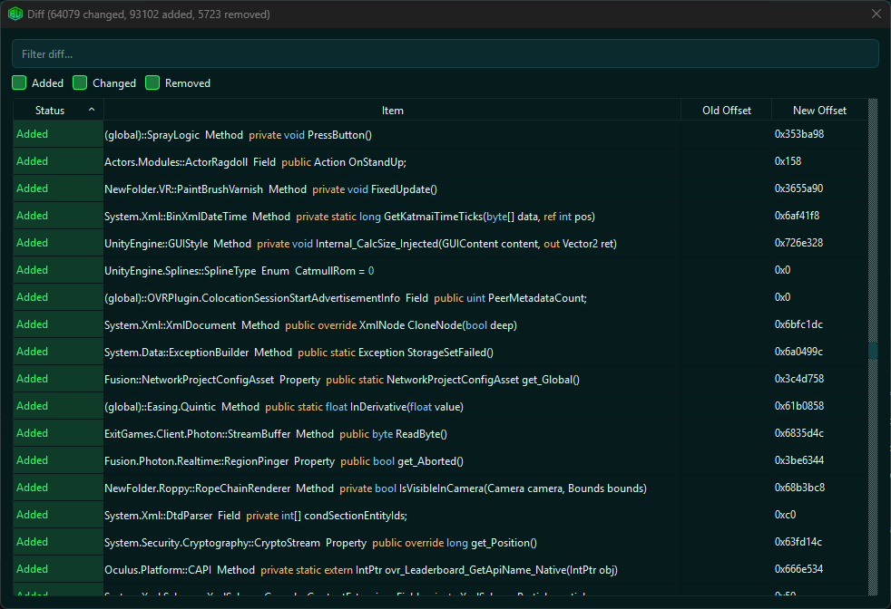

# DumpCsExplorer

A DnSpy-style explorer for `dump.cs` files (produced by an IL2CPP Dumper). Stop navigating dumps using notepad.

It’s built for reverse engineering and modding workflows where you need to:
- Browse namespaces/types/members quickly
- Search across large dumps
- Copy RVA/VA/offset values
- Compare two dumps to update offsets between versions and check for changes


## Screenshots

### Welcome screen



### Explorer (tree + details + search results)


### Compare / Diff dialog








## Features

### Explorer tree
- Namespace → Type → Member hierarchy.
- Type nodes expand into member groups (Constructors/Methods/Properties/Fields/Events/Enums).
- Lazy-loading keeps the UI responsive on large dumps.

### Member details pane
- Selecting any item updates the details pane.
- Shows the parsed signature/details for the selected entry.

### Copy helpers
- Double-click a member to copy:
  - Offset (preferred when present)
  - otherwise VA
- Right-click context menu for:
  - Copy Signature
  - Copy RVA
  - Copy Offset
  - Copy VA

### Search
- Search/filter within the tree.
- Dedicated results panel with:
  - Query box
  - Kind filters (Namespace/Type/Method/Ctor/Field/Property/Event/Enum)
  - Click a result to navigate to the matching tree item

### Syntax highlighting (signatures)
Signatures rendered in the tree and results list are token-highlighted:
- Modifiers (public/private/static/etc.)
- Primitive types (int/bool/string/etc.)
- Literals (true/false/null)
- Numbers (decimal + hex)

### Compare / Diff (two dumps)
After loading a primary dump, you can optionally load a second dump to compare against:
- Added members
- Removed members
- Changed members (offset changed)

Diff results include:
- Status filter checkboxes (Added/Changed/Removed)
- Text filter


## Building

### Requirements
- CMake 3.20+
- A C++20 compiler
- Qt6 (Widgets + Concurrent)

### Configure + build (CMake)

```bash
cmake -S . -B build
cmake --build build --config Release
```

- Then run (change path obviously) ```PATH\TO\QT\mingw_64\bin\windeployqt.exe --release --no-translations --no-system-d3d-compiler DumpCsExplorer.exe```

### Run
Open the built executable, then:
- Click **Open dump.cs**
- Optionally click **Compare...** after the first dump loads


## Project layout

- `src/parser/`
  - `DumpCsParser.*`: parsing logic for `dump.cs` into a lightweight in-memory model
- `src/ui/`
  - `MainWindow.*`: main UI, tree population, searching, diff dialog


## Notes

- This tool does **not** generate dumps. It assumes you already have `dump.cs`.
- Intended for large files: lazy-loading + lightweight indexing to keep interactions snappy.